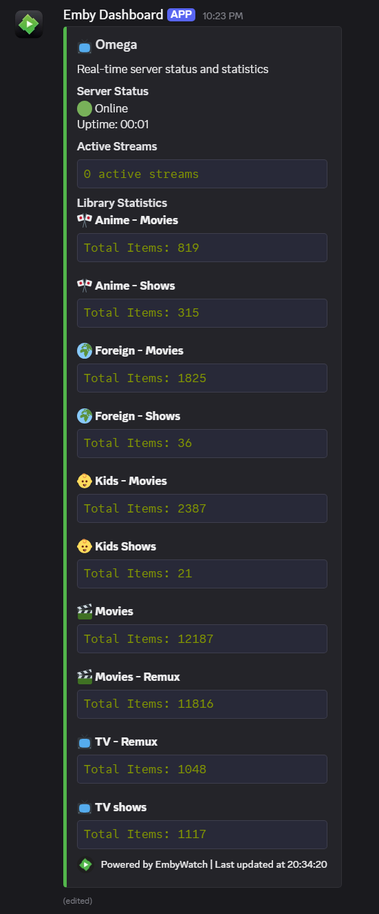

# JellyfinWatch 🎬

A Discord bot that monitors your Jellyfin server and displays real-time statistics in a beautiful dashboard. Built with Python and Discord.py.

## ✨ Features

- 📊 Real-time server statistics
- 📺 Library overview with item counts
- 👥 User activity monitoring
- 🎥 Currently playing content tracking
- ⚙️ Customizable dashboard appearance
- 🔄 Automatic updates every 30 seconds
- 🎨 Beautiful embed design with Jellyfin branding
- 🔒 Secure authentication with Jellyfin API
- 🛠️ Easy setup and configuration

## 📸 Screenshots



## 🚀 Getting Started

### Prerequisites

- Python 3.8 or higher
- Discord Bot Token
- Jellyfin Server URL and API Key
- Discord Server with admin permissions

### Creating a Discord Bot

1. Go to the [Discord Developer Portal](https://discord.com/developers/applications)
2. Click "New Application" and give it a name
3. Go to the "Bot" tab and click "Add Bot"
4. Under "Privileged Gateway Intents", enable:
   - PRESENCE INTENT
   - SERVER MEMBERS INTENT
   - MESSAGE CONTENT INTENT
5. Click "Reset Token" to get your bot token (save this for later)
6. Go to "OAuth2" → "URL Generator"
7. Select these scopes:
   - `bot`
   - `applications.commands`
8. Select these bot permissions:
   - `Send Messages`
   - `Embed Links`
   - `Attach Files`
   - `Read Message History`
   - `Use Slash Commands`
9. Copy the generated URL and open it in your browser to invite the bot to your server

### Installation

1. Clone the repository:
```bash
git clone https://github.com/d3v1l1989/JellyfinWatch.git
cd JellyfinWatch
```

2. Install dependencies:
```bash
pip install -r requirements.txt
```

3. Configure your environment variables in `.env`:
```env
DISCORD_TOKEN=your_discord_bot_token
JELLYFIN_URL=your_jellyfin_server_url
JELLYFIN_API_KEY=your_jellyfin_api_key
DISCORD_AUTHORIZED_USERS=user_id1,user_id2
```

4. Run the bot:
```bash
python main.py
```

### Docker Installation

1. Create a `docker-compose.yml` file:
```yaml
version: '3.8'

services:
  jellywatch:
    image: ghcr.io/d3v1l1989/jellyfinwatch:latest
    container_name: jellywatch
    restart: unless-stopped
    user: "1000:1000"
    environment:
      - DISCORD_TOKEN=${DISCORD_TOKEN}
      - JELLYFIN_URL=${JELLYFIN_URL}
      - JELLYFIN_API_KEY=${JELLYFIN_API_KEY}
      - JELLYFIN_USERNAME=${JELLYFIN_USERNAME}
      - JELLYFIN_PASSWORD=${JELLYFIN_PASSWORD}
      - CHANNEL_ID=${CHANNEL_ID}
      - DISCORD_AUTHORIZED_USERS=${DISCORD_AUTHORIZED_USERS}
      - RUNNING_IN_DOCKER=true
    volumes:
      - ./data:/app/data
      - ./logs:/app/logs
```

2. Create necessary directories and environment file:
```bash
# Create directories
mkdir -p data logs

# Set correct permissions
sudo chown -R 1000:1000 data logs

# Copy and edit environment file
cp .env.example .env
nano .env  # Edit with your configuration
```

3. Start the container:
```bash
docker compose up -d
```

## 🛠️ Configuration

The bot uses a `.env` file for configuration. Here are the available options:

- `DISCORD_TOKEN`: Your Discord bot token
- `JELLYFIN_URL`: Your Jellyfin server URL
- `JELLYFIN_API_KEY`: Your Jellyfin API key
- `JELLYFIN_USERNAME`: Your Jellyfin username
- `JELLYFIN_PASSWORD`: Your Jellyfin password
- `CHANNEL_ID`: The Discord channel ID where the dashboard will be displayed
- `DISCORD_AUTHORIZED_USERS`: Comma-separated list of Discord user IDs authorized to use admin commands

## 🤖 Commands